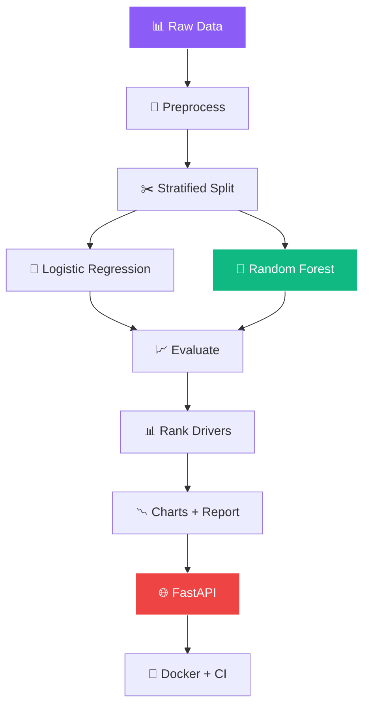

<!-- ═══════════════════════════════════════════════════════════════ -->
<!-- 🔥 Customer Churn — Linear Issue Tracker Style README -->
<!-- ═══════════════════════════════════════════════════════════════ -->

<!-- ═══════ LINEAR-STYLE HEADER ═══════ -->
<div align="center">
  
</div>

<!-- ═══════ LIVE ISSUE CARD (Coolreadme) ═══════ -->
<div align="center">
  <a href="https://github.com/sumit966/customer-churn-analysis">
    
  </a>
</div>

<br/>

<!-- ═══════ TERMINAL EMULATOR (Typewriter) ═══════ -->
<div align="center">
  
</div>

<br/>

<!-- ═══════ AI MASCOTS ═══════ -->
<div align="center">
  
  
  
  
  
</div>

<br/>

<!-- ═══════ AI SCENES ═══════ -->
<div align="center">
  
  
  
</div>

<br/>

<!-- ═══════ LIVE BADGES ═══════ -->
<div align="center">
  <a href="https://github.com/sumit966/customer-churn-analysis/stargazers">
    
  </a>
  <a href="https://github.com/sumit966/customer-churn-analysis/network/members">
    
  </a>
  <a href="https://github.com/sumit966/customer-churn-analysis/issues">
    
  </a>
  <a href="https://github.com/sumit966/customer-churn-analysis/commits/main">
    
  </a>
</div>

<br/>

<div align="center">
  
  
  
  
  
</div>

<br/>

<div align="center">
  
  
  
  
</div>

<br/>

<div align="center">
  <i>🔥 Churn Analytics Project · Author: <b>Sumit Raj</b> · M.Tech VNIT Nagpur · Ex-Salesforce</i>
</div>

<br/>


---

## 🎯 Overview


A complete **churn analytics pipeline** that:

<table>
<tr>
<td width="25%" align="center">

### 1️⃣ Generate


Synthetic telecom data

</td>
<td width="25%" align="center">

### 2️⃣ Preprocess


OneHotEncoder + StandardScaler

</td>
<td width="25%" align="center">

### 3️⃣ Train


LR + Random Forest

</td>
<td width="25%" align="center">

### 4️⃣ Serve


Predict + Drivers + Metrics

</td>
</tr>
</table>

> **🎯 Purpose:** Predict churn **before it happens**, rank the **top drivers**, and give retention teams a **prioritized action list**.

---

## ❌ Problem Statement

Customer churn is the **silent killer** of subscription businesses:

| ❌ Issue | Impact |
|---------|--------|
| 📉 **5% churn increase** | **25%+ profit loss** (Bain & Company) |
| 🕵️ **Discover churn after it happens** | Too late to intervene |
| 🎯 **Generic retention campaigns** | Waste budget on low-risk customers |
| 📊 **No ranked drivers** | Don't know which factor to fix first |

> **Raw transaction data alone doesn't answer these questions. Structured analysis and prediction do.**

---

## ✅ Solution

A **churn analytics pipeline** that:

- ⚡ **Predicts per-customer churn probability** in milliseconds
- 🎯 **Classifies** each customer as Low / Medium / High risk
- 📊 **Ranks the top churn drivers** so retention teams know what to prioritize
- 📈 **Produces charts** for stakeholder communication
- 🌐 **Serves predictions** over HTTP for CRM integration

---

## 🏗️ Architecture

### 🔥 Churn Pipeline Flow



### 📐 ASCII Fallback

```
Raw Customer Data (5000 records)
         |
         v
Preprocessing (OneHotEncoder + StandardScaler)
         |
         v
Stratified Train/Test Split
         |
         v
+--------------------+
| Logistic Regression |
| Random Forest (Best)|
+--------------------+
         |
         v
Evaluate (Acc, Prec, Recall, F1, AUC-ROC)
         |
         v
Rank Churn Drivers (feature importance)
         |
         v
Charts + Markdown Report
         |
         v
FastAPI Endpoint: /predict  /drivers  /metrics
         |
         v
Docker + GitHub Actions CI
```

---

## 🛠️ Tech Stack

<table align="center">
<tr>
<td><b>Category</b></td>
<td><b>Technologies</b></td>
</tr>
<tr>
<td>🤖 ML</td>
<td></td>
</tr>
<tr>
<td>📊 Data</td>
<td> </td>
</tr>
<tr>
<td>🔧 Preprocessing</td>
<td>  </td>
</tr>
<tr>
<td>📈 Visualization</td>
<td> </td>
</tr>
<tr>
<td>🌐 API</td>
<td>  </td>
</tr>
<tr>
<td>🧪 Testing</td>
<td> </td>
</tr>
<tr>
<td>🐳 Container</td>
<td></td>
</tr>
<tr>
<td>⚙️ CI/CD</td>
<td></td>
</tr>
<tr>
<td>🐍 Language</td>
<td></td>
</tr>
</table>

---

## 📦 Project Structure

```
customer-churn-analysis/
│
├── 🐍 src/
│   ├── __init__.py
│   ├── 📊 data_generator.py      # Generate synthetic churn dataset
│   ├── 🧹 preprocess.py          # Encode + scale features
│   ├── 🎯 train.py               # Train + rank drivers
│   ├── 📈 evaluate.py            # Evaluate saved model
│   └── 📉 report.py              # Charts + Markdown report
│
├── 🌐 api/
│   ├── __init__.py
│   └── main.py                   # FastAPI prediction service
│
├── 🧪 tests/
│   ├── __init__.py
│   └── test_api.py               # pytest tests
│
├── 📊 data/                       # Generated CSVs (git-ignored)
├── 💾 models/                     # Saved models (git-ignored)
├── 📈 reports/                    # Charts + report (git-ignored)
├── ⚙️ .github/workflows/ci.yml
├── 🐳 Dockerfile
├── 📋 requirements.txt
├── 🚫 .gitignore
├── 📜 LICENSE
└── 📖 README.md
```

---

## 🚀 Quick Start

<div align="center">
  
  
</div>

<br/>

### 1️⃣ Clone

```bash
git clone https://github.com/sumit966/customer-churn-analysis.git
cd customer-churn-analysis
```

### 2️⃣ Virtual Environment

**Windows:**

```bash
python -m venv venv
venv\Scripts\activate
```

**macOS / Linux:**

```bash
python3 -m venv venv
source venv/bin/activate
```

### 3️⃣ Install Dependencies

```bash
pip install -r requirements.txt
```

### 4️⃣ Generate Dataset

```bash
python src/data_generator.py
```

**Output:**

```
[OK] Generated 5000 customers -> data/churn.csv
[OK] Churn rate: XX.XX%
```

### 5️⃣ Train Models

```bash
python src/train.py
```

**Output:**

```
[Training] logistic_regression...
   Accuracy:  0.XX
   AUC-ROC:   0.XX
[Training] random_forest...
   Accuracy:  0.XX
   AUC-ROC:   0.XX

[Best] random_forest (AUC-ROC: 0.XX)

[Top churn drivers]
   cat__contract_Month-to-month: 0.XX
   num__tenure: 0.XX
   ...
```

### 6️⃣ Generate Charts + Report

```bash
python src/report.py
```

**Creates:**

```
reports/
├── 📈 churn_by_contract.png
├── 📉 churn_by_tenure.png
├── 📊 churn_by_payment.png
├── 🎯 top_churn_drivers.png
└── 📄 report.md
```

### 7️⃣ Start the API

```bash
uvicorn api.main:app --reload
```

**API runs at** http://localhost:8000

### 8️⃣ Open Swagger UI

```bash
http://localhost:8000/docs
```

---

## 🔌 API Usage

### 🔵 POST `/predict`

**Request:**

```json
{
  "gender": "Male",
  "senior_citizen": 0,
  "partner": "Yes",
  "dependents": "No",
  "tenure": 12,
  "contract": "Month-to-month",
  "internet_service": "Fiber optic",
  "tech_support": "No",
  "payment_method": "Electronic check",
  "paperless_billing": "Yes",
  "monthly_charges": 95.5,
  "total_charges": 1146.0
}
```

**Response:**

```json
{
  "churn_probability": 0.72,
  "risk_level": "High",
  "top_drivers": [
    {"feature": "cat__contract_Month-to-month", "importance": 0.24},
    {"feature": "num__tenure", "importance": 0.18},
    {"feature": "cat__internet_service_Fiber optic", "importance": 0.14}
  ]
}
```

### 🟢 GET `/drivers`

Returns the top churn drivers ranked by feature importance.

### 🟢 GET `/metrics`

Returns all model metrics from training (accuracy, precision, recall, F1, AUC-ROC).

### 📋 Other Endpoints

| Endpoint | Method | Purpose |
|----------|:------:|---------|
| 🔵 `/` | 🟢 GET | API info |
| 💚 `/health` | 🟢 GET | Health check |
| 📘 `/docs` | 🟢 GET | Swagger UI |
| 📗 `/redoc` | 🟢 GET | Alternative docs |

---

## 📊 Model Performance

| Model | Accuracy | Precision | Recall | F1 | AUC-ROC |
|-------|:--------:|:---------:|:------:|:--:|:-------:|
| 📊 Logistic Regression | 0.XX | 0.XX | 0.XX | 0.XX | 0.XX |
| 🌲 **Random Forest** | 0.XX | 0.XX | 0.XX | 0.XX | **0.XX** |

> 💡 Run `python src/train.py` to see exact numbers on your machine.

---

## 🎯 Top Churn Drivers

Based on feature importance from the trained **Random Forest**:

<table>
<tr>
<td width="10%" align="center">

### 🥇

</td>
<td width="40%">

**Contract = Month-to-month**

</td>
<td width="50%">

Highest churn driver by far

</td>
</tr>
<tr>
<td align="center">

### 🥈

</td>
<td>

**Tenure**

</td>
<td>

First 12 months are the riskiest

</td>
</tr>
<tr>
<td align="center">

### 🥉

</td>
<td>

**Internet Service = Fiber optic**

</td>
<td>

Higher churn than DSL

</td>
</tr>
<tr>
<td align="center">

### 4️⃣

</td>
<td>

**Payment Method = Electronic check**

</td>
<td>

Churn-heavy payment

</td>
</tr>
<tr>
<td align="center">

### 5️⃣

</td>
<td>

**Tech Support = No**

</td>
<td>

Support users stick around

</td>
</tr>
<tr>
<td align="center">

### 6️⃣

</td>
<td>

**Monthly Charges**

</td>
<td>

Higher charges correlate with churn

</td>
</tr>
</table>

---

## 📊 Business Insights

| 🔍 Finding | 💡 Recommendation |
|-----------|-------------------|
| Month-to-month customers churn **3x more** | Offer annual plan discounts |
| First-year customers are **highest risk** | Build onboarding + early-engagement program |
| Fiber optic users churn more | Investigate pricing or service quality issues |
| Electronic-check payers churn more | Incentivize auto-pay migration |
| Tech-support subscribers churn less | Bundle support into base plans |

---

## 🧪 Testing

```bash
pytest tests/ -v
```

**Tests cover:**

- 🟢 Root endpoint responds
- 💚 Health check reports model status
- 🔵 `/predict` returns valid probability (0 to 1) and risk level
- ❌ Invalid payload (missing fields) returns **422**

---

## 🐳 Docker

### 🔨 Build

```bash
docker build -t customer-churn-analysis .
```

### ▶️ Run

```bash
docker run -p 8000:8000 customer-churn-analysis
```

> 📌 The Dockerfile **generates data and trains the model automatically** during build.

---

## ⚙️ CI/CD Pipeline

Every push to `main` triggers GitHub Actions:

```
╔══════════════════════════════════════════════════╗
║              GITHUB ACTIONS WORKFLOW             ║
╠══════════════════════════════════════════════════╣
║                                                  ║
║  [1/4] 📥 Install Python 3.11 + deps            ║
║       │                                          ║
║       ▼                                          ║
║  [2/4] 📊 Generate synthetic dataset            ║
║       │                                          ║
║       ▼                                          ║
║  [3/4] 🎯 Train LR + Random Forest              ║
║       │                                          ║
║       ▼                                          ║
║  [4/4] 🧪 Run pytest test suite                 ║
║       │                                          ║
║       ▼                                          ║
║  ✅ PASSED                                       ║
║                                                  ║
╚══════════════════════════════════════════════════╝
```

> 📄 See `.github/workflows/ci.yml`

---

## 🎓 Key Learnings

<table>
<tr>
<td width="50%" valign="top">

### 🧠 ML Insights

- 🎯 **Contract type is the single strongest predictor** — behavioral, not demographic
- 📊 **Tenure buckets outperform raw tenure** — churn risk is nonlinear
- 🏆 **Feature importance from RF** beats correlation for driver ranking
- 📈 **AUC-ROC is the right metric** for imbalanced classification

</td>
<td width="50%" valign="top">

### 🛠️ Engineering Insights

- 🔧 **OneHotEncoder + StandardScaler in ColumnTransformer** keeps preprocessing clean
- ✂️ **Stratified split** preserves class balance
- 🎯 **Per-customer probability + risk level** lets CRM teams prioritize outreach
- 🐳 **Docker reproducibility** for ML workflows

</td>
</tr>
</table>

---

## 🚀 Future Improvements

| 🌟 | Feature |
|:--:|---------|
| 🔍 | **SHAP values** for per-customer explanations |
| 🚀 | **XGBoost / LightGBM** comparison |
| 📈 | **Survival analysis** (Cox proportional hazards) |
| 🎯 | **Uplift modeling** — estimate impact of retention offers |
| 📦 | **Real dataset** (Kaggle Telco Customer Churn) |
| ☁️ | **Deploy to GCP Cloud Run** |
| 🔄 | **Real-time scoring** integration with CRM |
| 🧪 | **A/B test** retention campaigns |

---

## 👤 Author

<div align="center">


<br/><br/>


<br/><br/>

<b>M.Tech Applied AI & ML @ VNIT Nagpur</b><br/>
<i>Ex-Software Engineer Intern @ Salesforce</i>

<br/><br/>

<a href="https://sumit966.github.io">
  
</a>
<a href="https://www.linkedin.com/in/er-sumit-raj-/">
  
</a>
<a href="https://github.com/sumit966">
  
</a>
<a href="mailto:info.sr0909@gmail.com">
  
</a>

<br/><br/>


</div>

---

## 📄 License

<div align="center">


<br/>


<br/><br/>

<samp>
Released under the <b>MIT License</b> — see <a href="LICENSE">LICENSE</a> file.
</samp>

<br/><br/>

<sub><samp>© 2025 &nbsp;·&nbsp; SUMIT RAJ &nbsp;·&nbsp; ALL RIGHTS RESERVED</samp></sub>

<br/>


</div>

<br/>

<!-- ═══════ WORKING AI SCENES FOOTER ═══════ -->
<div align="center">
  
  
  
</div>

<br/>

<!-- ═══════ ANIMATED FOOTER ═══════ -->
<div align="center">
  
</div>
